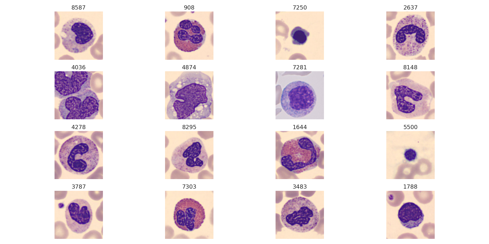
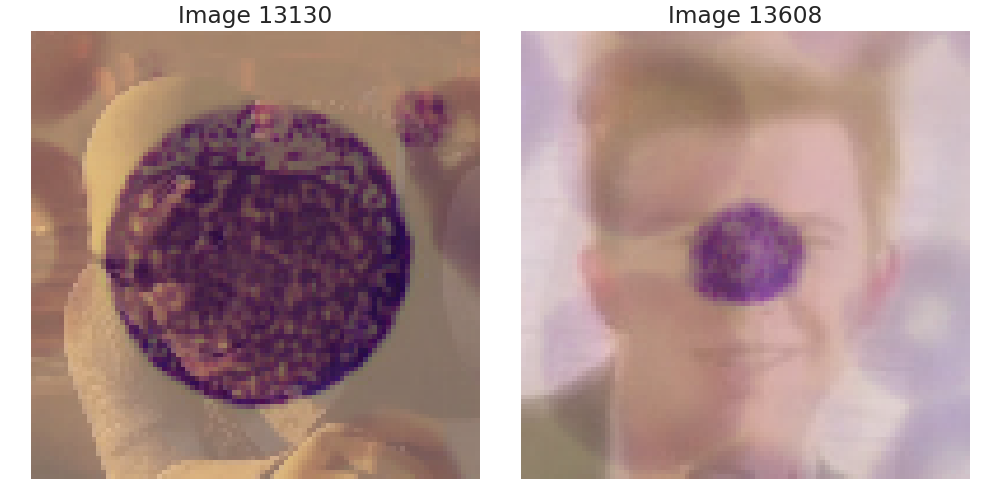
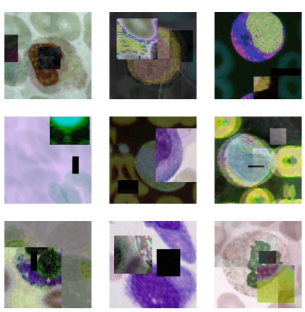

# First challenge

This is the first challenge of the AN2DL course.

## Task

Objective of the challenge is to implement a Convolutional Neural Network for image classification of various types of peripheral blood cells

...with a bunch (~1800) of images put there to make it look cool.

## Final results

Our cells looked like this:

But, our final model had an accuracy on the test set of **96.05%**, earning us a **silver medal 🥈** in the competition, which is pretty cool.