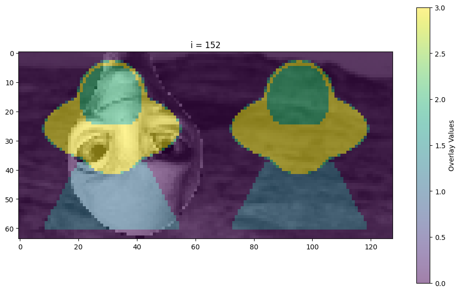

# Second challenge

This is the first challenge of the AN2DL course.

## Task

Objective of the challenge is to implement a Convolutional Neural Network for image segmentation of martian surface images. 

Each image is a grayscale image of 64x128 pixels, and the goal is to classify each pixel as one of the following classes:

- 0: background
- 1: soil
- 2: bedrock
- 3: sand
- 4: big rocks

The dataset had ~800 noise images put there to make it look cool. Fortunately, they all have the same label, so we can easily identify them and remove them from the dataset.

## Final results

Our cells looked like this (the background predictions are not included in the score calculation, so we never predicted class 0):

The scores were computed on the mean Intersection over Union (IoU) metric, and we achieved a score of 0.71803 on the first test split and 0.63859 on the second test split, resulting in a 29th place on the leaderboard, which is not what we aimed for, but it's a solid result if we think that we were competing against 188 teams.