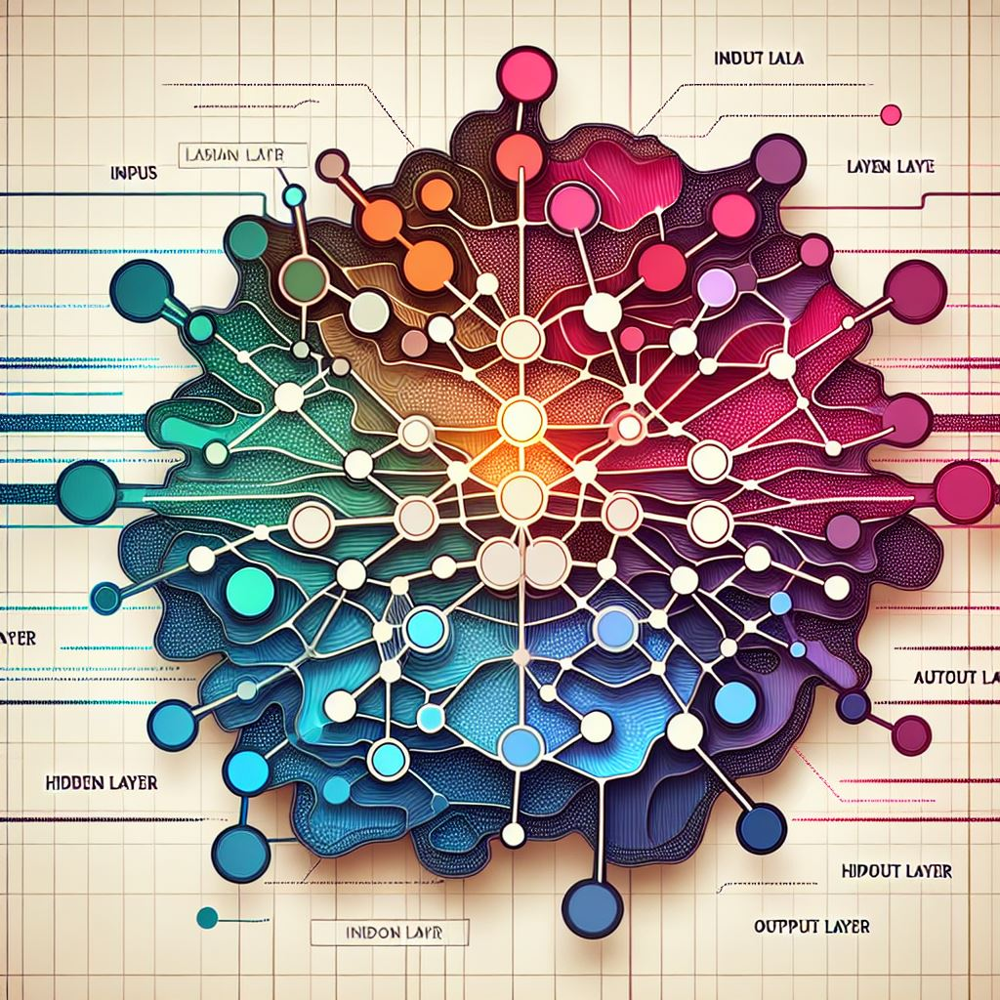

# AN2DL Challenges

This repository contains the solutions to the two challenges of the [Artificial Neural Networks and Deep Learning](https://www4.ceda.polimi.it/manifesti/manifesti/controller/ManifestoPublic.do?EVN_DETTAGLIO_RIGA_MANIFESTO=evento&aa=2024&k_cf=225&k_corso_la=481&k_indir=T2A&codDescr=054307&lang=IT&semestre=1&idGruppo=4935&idRiga=308203) course at Politecnico di Milano proposed by the group **ANNamo bene**, composed by:

- [Nicolò Tocalli](https://github.com/nicolotocalli) -Email: nicolo.tocalli@mail.polimi.it
- [Michelangelo Stasi](https://github.com/MyKe01) - Email: michelangelo.stasi@mail.polimi.it
- [Elia Pontiggia](https://github.com/pontig) - Email: elia.pontiggia@mail.polimi.it

